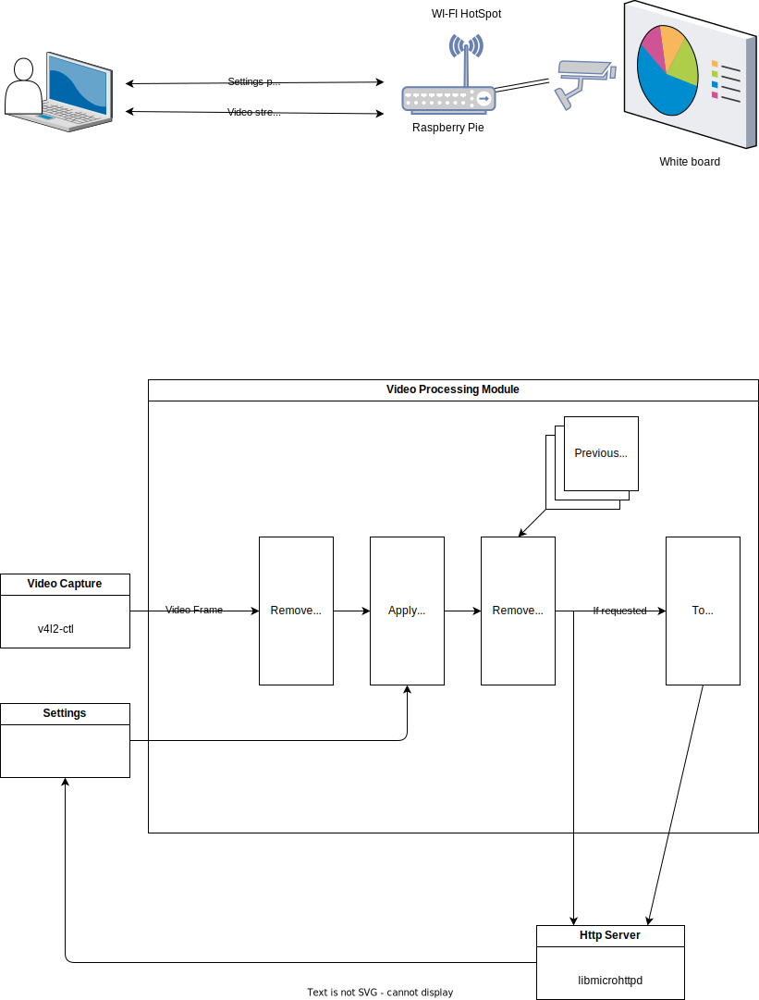

## Общий принцип работы

Камера получает изображение с доски.
Raspberry Pi производит обработку кадра: выравнивает кадр, удаляет шум/лишние предметы...
Пользователь подключается к Raspberry Pi через локальную точку доступа и переходит в веб-интерфейс
Веб-интерфейс позволяет настроить обработку изображения и перейти к стримингу видео потока, а также сконвертировать отдельные кадры в SVG

## Физические компоненты

- Web-камера для получения изображения
- Raspberry Pi 4B для обработки и передачи изображения
- Корпус с креплением для штатива

## Программные компоненты

Обработка происходит следующим образом:

При старте программа открывает локальную точку доступа и запускает http-сервер
Http-сервер отдает html с интерфейсом управления настройками и обрабатывает ввод новых настроек (`localhost:8080/settings`)
Параллельно происходит захват видео с камеры, обработка кадров и трансляция их также через точку доступа (`localhost:8080/stream`)
Во время обработки видео кадр выравнивается, удаляются шумы, изменяются цветовые настройки в соответствии с конфигурацией, указанной в веб-интерфейсе
При получении запроса на конвертацию кадра в SVG, текущий кадр видео-потока конвертируется в SVG и сохраняется в директорию на устройстве пользователя

## Библиотеки

- Http-сервер `libmicrohttpd`
- Захват изображения `v4l2-ctl`
- Обработка видео `OpenCV`, [csvg](https://github.com/dev-harbour/csvg)
